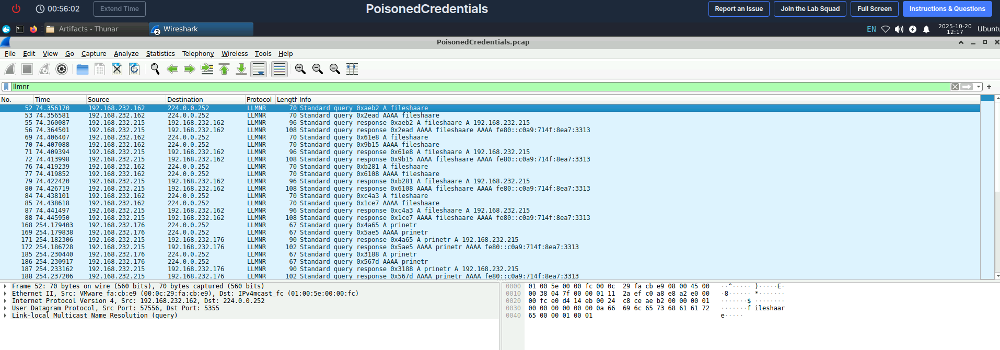
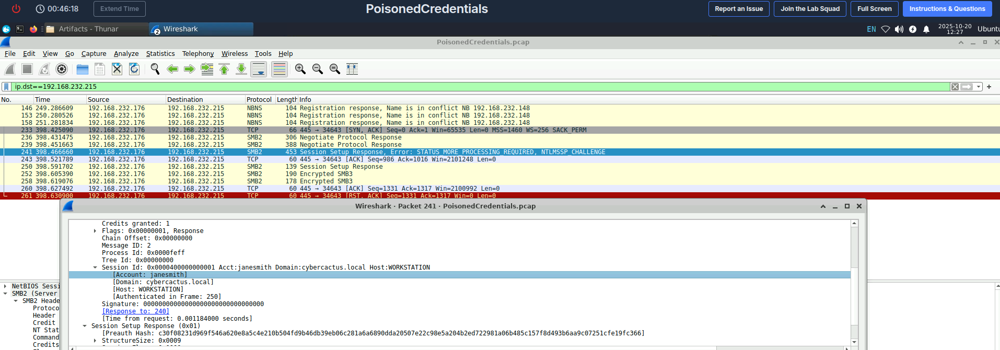
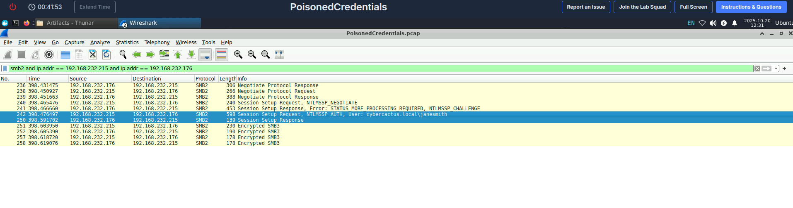

# Poisoned Credentials - CTF Write-up & Analysis

This document provides a step-by-step analysis of the "Poisoned Credentials" Blue Team challenge from CyberDefenders. The investigation covers the initial compromise vector, credential capture, and lateral movement, all identified through network traffic analysis.

---

##  Scenario Overview

The network traffic capture (`challenge.pcap`) reveals a classic **Man-in-the-Middle (MitM)** attack.  The attacker exploits insecure, legacy name resolution protocols—specifically **Link-Local Multicast Name Resolution (LLMNR)** and **NetBIOS Name Service (NBT-NS)**—to intercept credentials.

This attack is highly effective in Windows environments where these protocols are enabled by default. When a user tries to access a network share with a typo (`\\fileshaare` instead of `\\fileshare`), the Domain Name System (DNS) server correctly reports that the host does not exist. Instead of stopping, the user's computer "helpfully" falls back to LLMNR and NBT-NS, broadcasting a query to the entire local network asking, "Does anyone know where `fileshaare` is?" The attacker's machine simply has to answer first to become the man in the middle.

---

##  Tools Used

* **Wireshark:** The primary tool for deep packet inspection and analysis of the network traffic capture.

---

##  Step-by-Step Analysis

The analysis was performed by loading the `challenge.pcap` file into Wireshark and following the attacker's trail from the initial query to the final compromise.

### 1. The Initial Trigger: A Typo

The incident chain begins when the user at `192.168.232.162` attempts to access the non-existent share. This is evident in the traffic by looking for name resolution requests for `FILESHAARE`. Because a proper DNS server would not have a record for this mistyped name, the client resorts to LLMNR.

* **Wireshark Filter:** `llmnr`

The filter immediately reveals a multicast query from `192.168.232.162` asking "Who has FILESHAARE?". This is the bait.

**Figure 1:** The victim machine `192.168.232.162` broadcasting for `FILESHAARE`.

### 2. The Attack: LLMNR Poisoning 

The attacker's machine at `192.168.232.215` is running a tool like **Responder**, which is designed to listen for these specific LLMNR and NBT-NS queries. It immediately sends a unicast response directly to the victim, falsely claiming, "I am `FILESHAARE`, and my IP is `192.168.232.215`."

By responding first, the attacker wins the race against any potential legitimate server and successfully poisons the victim's name resolution cache. The victim now believes the attacker's machine is the intended destination.

**Figure 2:** The attacker `192.168.232.215` falsely claiming to be the requested host.

### 3. The Prize: Capturing the NTLMv2 Hash 

Trusting the malicious response, the victim's machine proceeds to authenticate with the attacker using the **Server Message Block (SMB)** protocol. The Windows authentication process uses **NTLMv2**, a challenge-response protocol. The victim sends the username and a hashed response to a challenge sent by the attacker's machine. This hash is not the user's password, but it can be captured and cracked offline using tools like **Hashcat** or used in "Pass-the-Hash" attacks.

* **Wireshark Filter:** `smb2.acct == "janesmith"`
* **Compromised User:** `janesmith`

By inspecting the SMB2 "Session Setup Request," we can clearly see the username `janesmith` and the captured NTLMv2 hash.

**Figure 3:** The user `janesmith`'s NTLMv2 hash being sent to the attacker.

### 4. The Goal: Lateral Movement 

Capturing the hash is just the first step. The attacker's ultimate goal is to use it to move laterally across the network. The traffic shows the attacker (`192.168.232.215`) immediately leveraging the captured credentials to successfully authenticate to another host: **`AccountingPC`** (`192.168.232.176`).

The attacker connects to the `IPC$` (Inter-Process Communication) share, a common technique to establish a session with a remote host to enumerate system information or execute commands.

* **Wireshark Filter:** `smb2 and ip.addr == 192.168.232.215 and ip.addr == 192.168.232.176`

The successful "Tree Connect Request" and "Tree Connect Response" confirm that the stolen credentials were valid for `AccountingPC`.

**Figure 4:** The attacker successfully connecting to `AccountingPC` using the stolen credentials.

---

##  Summary of Findings

* **Attack Type:** LLMNR Poisoning & Credential Capture (MitM)
* **Attacker IP:** `192.168.232.215`
* **Initial Victim IP:** `192.168.232.162`
* **Compromised Hostname:** `AccountingPC`
* **Compromised Host IP:** `192.168.232.176`
* **Compromised User Account:** `janesmith`
* **Root Cause:** Insecure legacy name resolution protocols (LLMNR and NBT-NS) are enabled on the network, allowing an attacker to intercept authentication attempts triggered by user error.

---

##  Mitigation and Recommendations

This attack is highly effective but also highly preventable. The following hardening steps are recommended:

1.  **Disable LLMNR and NBT-NS (Most Important!):** These protocols are unnecessary in any network with a working DNS server. They can be disabled via Group Policy:
    * **To Disable LLMNR:** `Computer Configuration > Administrative Templates > Network > DNS Client > Turn off multicast name resolution` -> **Enabled**.
    * **To Disable NBT-NS:** This is done via the network adapter's IPv4 settings under `WINS > Disable NetBIOS over TCP/IP`. This can also be deployed via DHCP.

2.  **Enforce SMB Signing:** This feature cryptographically signs SMB packets, which prevents them from being modified or relayed by a MitM attacker. This can break the attack chain even if credentials are intercepted. This can be enabled via Group Policy.

3.  **Implement Strong Password Policies:** While this doesn't prevent hash capture, it makes the offline cracking portion of the attack (using tools like Hashcat) much more difficult and time-consuming for the attacker.

4.  **Deploy an IDS/IPS:** An Intrusion Detection/Prevention System with up-to-date signatures (like those for Snort or Suricata) can detect and alert on LLMNR/NBT-NS poisoning activity, providing early notification of an attack.

5.  **Network Segmentation:** Properly segmenting the network can limit the broadcast/multicast domain, reducing the number of machines an attacker can target with this technique.

6.  **User Education:** Training users to double-check server names before connecting and to report any unusual certificate warnings or connection errors can help reduce the frequency of the initial trigger.
